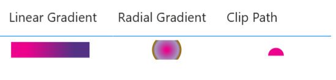

# Defs

This section documents SVG definition (defs) functions, which allow you to define reusable SVG elements such as `#!xml <linearGradient>`, `#!xml <clipPath>`, and shapes. 



!!! tip

    `DaxLib.SVG.Def.*` should be wrapped in [`#!dax DaxLib.SVG.Element.Defs()`](../elements/Defs.md) to add `<defs>...</,defs>` tags.

    Define an element once, then reuse with [`#!dax DaxLib.SVG.Element.UseDef()`](../elements/UseDef.md) to reduce SVG string length and improve performance.

    ```dax
    DaxLib.SVG.Element.Defs(
    	    DaxLib.SVG.Def.Circle(...) &
    	    DaxLib.SVG.Def.Rect(...)
    )
    // Returns: <defs>...</defs>
    ```