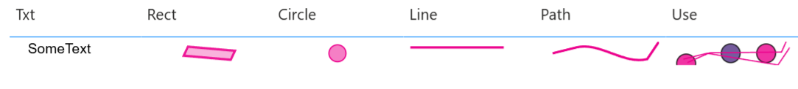

# Elements

This section documents the core SVG element functions available in DaxLib.SVG. These functions generate SVG primitives such as `#!xml <circle>`, `#!xml <rect>`, `#!xml <line>`, `#!xml <polygon>`, `#!xml <polyline>`, `#!xml <text>`, and `#!xml <<g>`. Use these to build up complex SVG graphics in Power BI.

